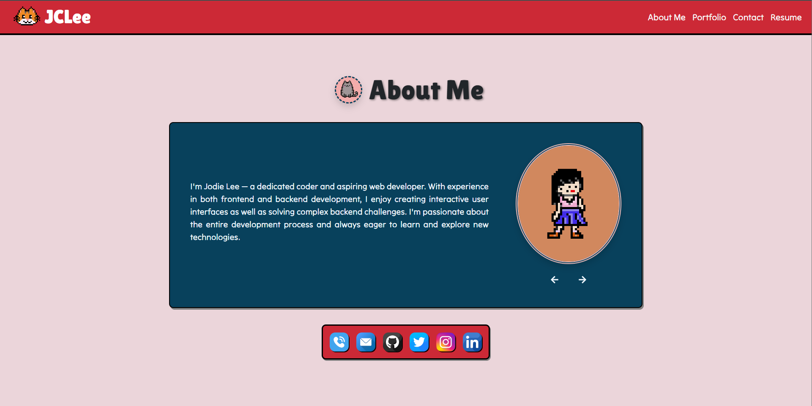
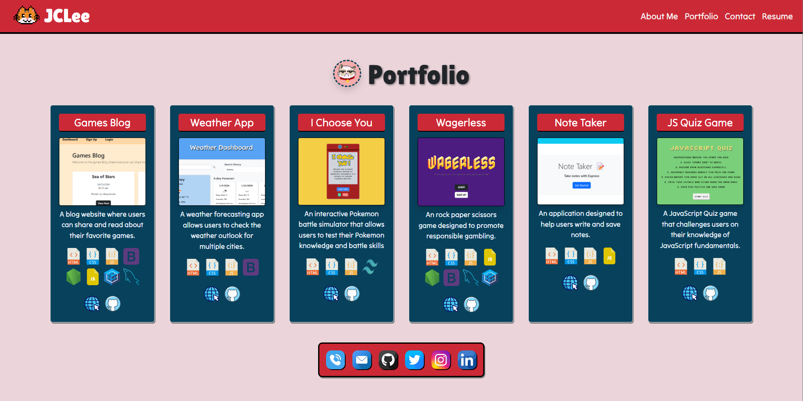
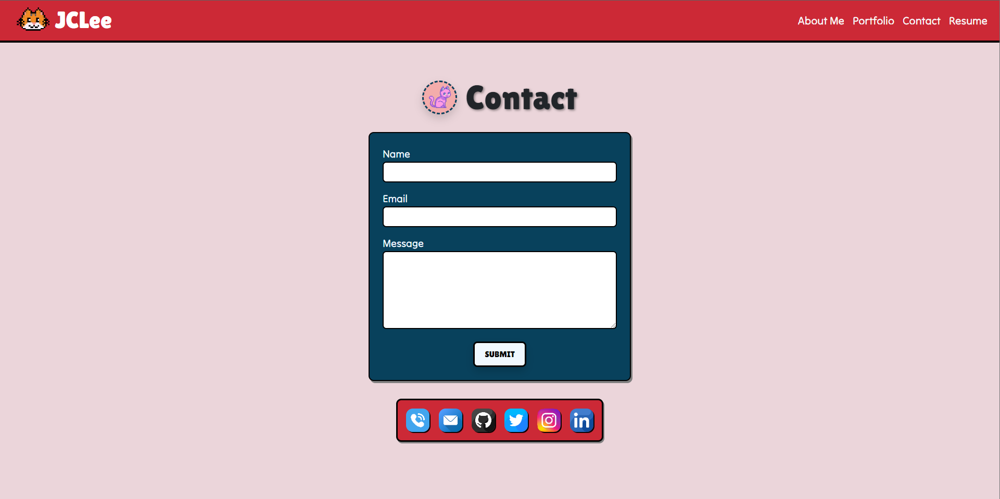
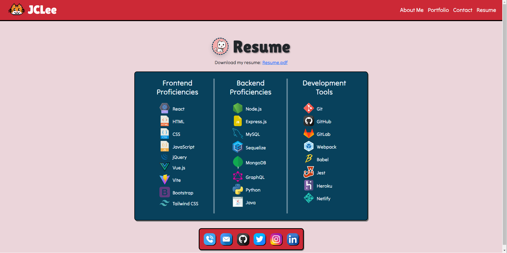

# Project Portfolio - React

[](https://opensource.org/licenses/MIT)

## Description

This project is a personal portfolio website built using React. The motivation behind creating this portfolio was to showcase my skills, projects, and experiences to potential employers and the developer community. It serves as a centralized platform to display my projects, share my background, and provide contact information.

### Problem Solving

The portfolio aims to solve the problem of presenting my work in an organized and visually appealing manner. 

### Learning

Through this project, I learned about React components, routing, state management, and the importance of responsive design in web development.

## Installation

To install and run this project locally, follow these steps:

1. Clone the repository to your local machine.
    
    git clone git@github.com:jodielee062788/react_project_portfolio.git

2. Open the project folder in your code editor.
3. Install the necessary dependencies by running the command:

    ```npm install```

4. Start the development server

    ```npm run dev```

## Usage

My portfolio consists of the following sections:

- About Me Page: Displays my short bio and an avatar.

    

- Portfolio Page: A selection of projects with descriptions, technologies used, and links to deployed apps and GitHub repositories.

    

- Contact Page: A contact form with fields for name, email address, and message.

    

- Resume Page: A link to download the my resume and a list of my proficiencies.

    


## Deployed Application to Netlify

Check out the deployed application of 'Project Portfolio' on Netlify [here](https://jclee-react-portfolio.netlify.app/).

## Credits

Visit my github to see all my works and projects. Feel free to contact me if you have any questions through my email: jodielee062788@gmail.com

## License
This project is licensed under the MIT License - see the [LICENSE](./LICENSE) file for details.

## How to Contribute

If you'd like to contribute to this project, please follow these guidelines:

1. Fork this project.
2. Create a new branch for your feature or bug fix.
3. Commit your changes.
4. Submit a pull request.
